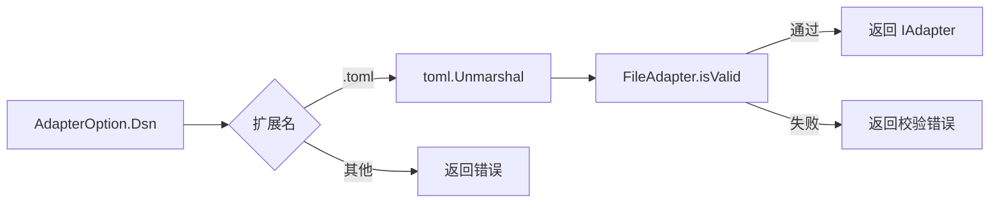
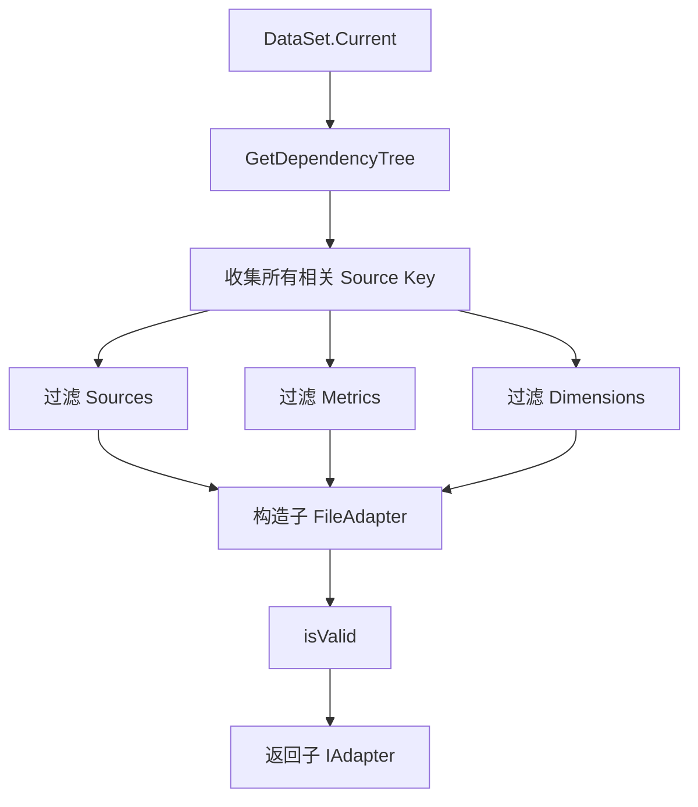
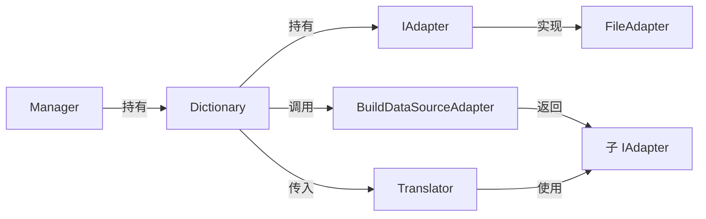

# Adapter Pattern —— Schema 适配器设计

## 1. 设计目标

`olap-sql` 的上层查询语义使用 **DataSet / Metric / Dimension** 等 OLAP 概念，而实际执行时必须落到具体数据库的表与列。Adapter 层负责把**声明式的业务 Schema** 映射为**内存中的可查询对象**，并向上层提供统一的查找接口。

核心目标：

- **隔离配置与实现**：Schema 通过配置文件（当前仅支持 TOML）声明，解析逻辑集中在 `dictionary_adapter.go`。
- **统一查询接口**：无论 Schema 来自文件还是未来可能扩展的数据库，`Dictionary` 只依赖 `IAdapter` 接口。
- **按需裁剪视图**：一个全局 FileAdapter 可以按 DataSet 裁剪出只包含相关 DataSource、Metric、Dimension 的**子适配器**，降低后续翻译阶段的搜索范围。
- **加载即校验**：Schema 在解析完成后立即执行一致性校验，尽早暴露配置错误。

## 2. 核心类型与接口

### 2.1 AdapterOption —— 配置入口

```go
type AdapterType string

const (
    FILEAdapter AdapterType = "FILE"
)

type AdapterOption struct {
    Type AdapterType `json:"type"`
    Dsn  string      `json:"dsn"`
}
```

- `Type`：适配器类型。当前仅支持 `FILE`（或空字符串，作为默认值）。
- `Dsn`：对 `FILE` 适配器而言，是配置文件的绝对或相对路径。

`NewAdapter` 根据 `Type` 路由到具体工厂函数：

```go
func NewAdapter(option *AdapterOption) (IAdapter, error) {
    switch option.Type {
    case FILEAdapter, "":
        return newDictionaryAdapterByFile(option)
    default:
        return nil, fmt.Errorf("not supported adapter type %v", option.Type)
    }
}
```

> **扩展点**：未来若支持从数据库或远程服务加载 Schema，只需新增 `AdapterType` 常量并实现对应工厂函数，无需修改 `Dictionary`。

### 2.2 IAdapter —— 统一抽象

```go
type IAdapter interface {
    BuildDataSourceAdapter(string) (IAdapter, error)

    GetMetric() []*models.Metric
    GetDimension() []*models.Dimension

    GetDataSetByKey(string) (*models.DataSet, error)
    GetSourceByKey(string) (*models.DataSource, error)
    GetMetricByKey(string) (*models.Metric, error)
    GetDimensionByKey(string) (*models.Dimension, error)

    GetMetricsBySource(string) []*models.Metric
    GetDimensionsBySource(string) []*models.Dimension
}
```

接口分为三组：

| 分组 | 方法 | 职责 |
|---|---|---|
| 子适配器构造 | `BuildDataSourceAdapter(key)` | 以某个 DataSource 为根，构造一个只包含其依赖子图的子适配器 |
| 全量枚举 | `GetMetric` / `GetDimension` | 返回当前适配器可见的所有 Metric / Dimension |
| 按键查找 | `GetDataSetByKey` / `GetSourceByKey` / `GetMetricByKey` / `GetDimensionByKey` | 按业务键查找对象；Source 同时支持 `Name` 和 `Alias` |
| 按源过滤 | `GetMetricsBySource` / `GetDimensionsBySource` | 返回属于指定 DataSource 的 Metric / Dimension |

## 3. FileAdapter 实现

### 3.1 数据结构

```go
type FileAdapter struct {
    Sets       []*models.DataSet
    Sources    []*models.DataSource
    Metrics    []*models.Metric
    Dimensions []*models.Dimension
}
```

字段与 TOML 配置中的四个顶层块一一对应：

```toml
sets       = [...]
sources    = [...]
metrics    = [...]
dimensions = [...]
```

TOML 通过 `BurntSushi/toml` 直接反序列化到 `FileAdapter` 结构体，字段名（Sets/Sources/Metrics/Dimensions）即为 TOML 块名。

### 3.2 文件加载流程



### 3.3 子适配器：BuildDataSourceAdapter

当 `Dictionary.Translator` 开始翻译某个 `Query` 时，它会先定位到目标 `DataSet`，然后调用 `BuildDataSourceAdapter` 构造一个**仅包含该 DataSet 所需 Schema** 的子适配器。

流程：

1. 以 `DataSet.GetCurrent()` 为根调用 `GetDependencyTree`，得到 DataSource 依赖树。
2. 收集树中所有 DataSource 的 `Name` / `Alias`。
3. 从全局 FileAdapter 中过滤出相关的 Sources、Metrics、Dimensions。
4. 对过滤后的子适配器再次执行 `isValid()`。



> **为什么需要子适配器？**
> 全局配置可能包含多个 DataSet 的完整 Schema。子适配器把翻译上下文限制在目标 DataSet 的依赖子图内，避免不同 DataSet 之间的 Metric / Dimension 命名冲突，同时让后续翻译阶段的查找更精确。

## 4. 校验模型

`FileAdapter.isValid()` 按以下顺序校验四类对象：

| 对象 | 校验内容 |
|---|---|
| `DataSet` | `Current` 指向的 Source 必须是 `fact` 类型 |
| `DataSource` | 自身类型合法；Join 引用的 Dimension 必须存在；非 Dimension 类型必须能构建依赖树 |
| `Metric` | 所属 Source 存在；依赖的 Metric（如果有）存在 |
| `Dimension` | 所属 Source 存在 |

### 4.1 关键校验函数

- `IsValidJoin(adapter, join)`：检查 Join 的 `Dimension` 列表在目标 DataSource 中是否真实存在。
- `GetDependencyTree(adapter, current)`：以某个 Source 为根，沿 `DimensionJoin` / `MergeJoin` 展开依赖树，并校验其为**树结构**（无环、每个节点只有一个父节点）。

依赖树校验失败的典型情况：

- 某个节点被访问超过一次 → 存在环或多父节点。
- 依赖图中有多个根节点 → 配置错误。
- 依赖的 Source 不存在 → 配置错误。

## 5. 与 Dictionary / Manager 的协作



调用链：

1. 用户创建 `Configuration`，其中 `DictionaryOption.Dsn` 指向 TOML 文件。
2. `NewManager` 调用 `NewDictionary`，`NewDictionary` 调用 `NewAdapter` 得到 `IAdapter`。
3. 查询时，`Manager.build` → `Dictionary.Translate` → `Adapter.GetDataSetByKey` 定位 DataSet。
4. `BuildDataSourceAdapter(DataSet.Current)` 得到子适配器，交给 `NewTranslator`。
5. `Translator` 在子适配器范围内查找 Metric / Dimension / Source，生成 `types.Clause`。

## 6. 配置示例

见 [`test/dictionary.sqlite.toml`](../../test/dictionary.sqlite.toml)。该文件展示了：

- `sets` 块：定义 DataSet 名称、数据库类型、入口 DataSource。
- `sources` 块：定义 Fact / Dimension / Fact-Dimension-Join / Merge-Join 四种类型的 DataSource。
- `metrics` / `dimensions` 块：按 `data_source` 归属声明业务字段。

## 7. 设计决策与约束

### 7.1 当前只支持 FILE 适配器

这是项目当前的实际状态。AdapterType 抽象和工厂函数已经预留了扩展点，但当前没有数据库、HTTP 或远程配置适配器。

### 7.2 Source 查找同时支持 Name 和 Alias

```go
if source.GetKey() == key || source.Alias == key {
    return source, nil
}
```

这使得 TOML 中可以用更短或更业务化的别名引用 DataSource，而 Metric / Dimension 的 `data_source` 字段仍使用真实 Name。

### 7.3 Metric / Dimension 按键查找严格使用 `{data_source}.{name}`

```go
func (m *Metric) GetKey() string {
    return fmt.Sprintf("%v.%v", m.DataSource, m.Name)
}
```

因此查询中的 Metric / Dimension 名称在不同 DataSource 下可以重复，只要全限定键唯一即可。

### 7.4 加载即校验的代价

`isValid()` 会对每个 DataSource 构建依赖树，时间复杂度与 Schema 规模成正比。由于 Schema 通常在服务启动时加载一次，这种一次性校验是可以接受的；后续查询只使用已校验的子适配器。

## 8. 相关文件

| 文件 | 说明 |
|---|---|
| `dictionary_adapter.go` | Adapter 接口与 FileAdapter 实现 |
| `dictionary.go` | `Dictionary` 封装，负责 Adapter → Translator 的衔接 |
| `manager.go` | `Manager` 入口，持有 Dictionary 和 Clients |
| `api/models/schema.go` | `DataSet`、`DataSource`、`Metric`、`Dimension` 等模型定义 |
| `test/dictionary.sqlite.toml` | SQLite 测试环境的完整 Schema 配置 |
| `test/dictionary.ck.toml` | ClickHouse 测试环境的 Schema 配置 |

## 9. 待讨论/扩展

- **Adapter 类型扩展**：未来是否支持从数据库表或远程 API 加载 Schema？
- **更丰富的校验**：当前 Metric 的 `Filter` 未校验引用的 Metric/Dimension 是否存在（代码中标注 `TODO (2)`）。
- **性能优化**：大型 Schema 下，`findByKey` 使用线性扫描；若 Schema 规模显著增长，可考虑建立索引。
