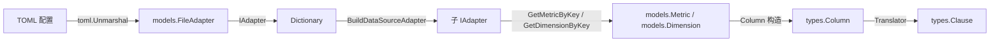
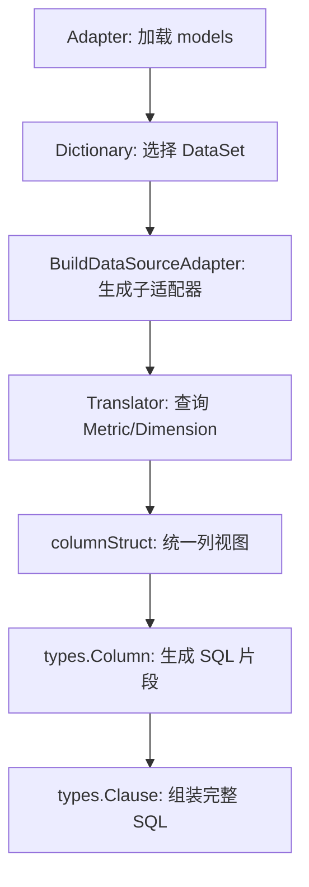

# Schema Mapping —— 字典到物理 Schema 的映射设计

## 1. 设计目标

`olap-sql` 的核心抽象是把 OLAP 业务语义（DataSet、Metric、Dimension）翻译成后端 SQL。在这一过程中，必须完成两次关键映射：

1. **配置 → 运行时**：把 TOML 中声明的 `models.DataSet` / `models.DataSource` / `models.Metric` / `models.Dimension` 转换为查询阶段使用的 `types.DataSource` / `types.Metric` / `types.Dimension`。
2. **业务字段 → SQL 列**：把 Metric / Dimension 映射为 `types.Column`（`SingleCol` / `ArithmeticCol` / `ExpressionCol`），最终生成 `SELECT` 列表与 `JOIN` 条件。

`schema-mapping.md` 关注第一次映射；第二次映射由 `translator-chain.md` 和 `column.go` 完成，但两者的数据模型边界在此处定义。

核心目标：

- **明确 models 与 types 的职责边界**：models 是配置层，types 是运行时层，不可混用。
- **解释 DataSource 的多态性**：Fact / Dimension / Fact-Dimension-Join / Merge-Join 四种类型如何影响映射结果。
- **说明 columnStruct 的封装动机**：统一 Metric 与 Dimension，供后续翻译阶段无差别处理。
- **记录键与引用的约定**：`{data_source}.{name}` 全限定键、依赖列表、别名等。

## 2. 配置层模型：`api/models/schema.go`

`models` 包对应 TOML 配置文件中的结构，字段命名以 TOML 反序列化为主。

### 2.1 DataSet

```go
type DataSet struct {
    Name        string       `toml:"name"`
    DBType      types.DBType `toml:"type"`
    Description string       `toml:"description"`
    DataSource  string       `toml:"data_source"`
}
```

- `Name`：业务 DataSet 名称，用户查询时通过 `Query.DataSetName` 引用。
- `DBType`：目标数据库类型（MySQL、ClickHouse、SQLite、Postgres），决定后续翻译方言。
- `DataSource`：入口 DataSource 的 `Name` 或 `Alias`，即查询的"主表"。

### 2.2 DataSource

```go
type DataSource struct {
    Database      string               `toml:"database"`
    Name          string               `toml:"name"`
    Alias         string               `toml:"alias"`
    Type          types.DataSourceType `toml:"type"`
    Description   string               `toml:"description"`
    DimensionJoin DimensionJoins       `toml:"dimension_join"`
    MergeJoin     MergeJoin            `toml:"merge_join"`
}
```

四种类型：

| 类型 | 语义 | 典型用途 |
|---|---|---|
| `fact` | 事实表 | 查询的主表，存放 Metric |
| `dimension` | 维度表 | 通过 JOIN 提供 Dimension |
| `fact_dimension_join` | 事实表 + 维度表 JOIN | 一个事实表关联一个或多个维度表 |
| `merge_join` | 多表合并 | 把多张结构相似的表横向合并 |

### 2.3 Metric / Dimension

```go
type Metric struct {
    DataSource  string           `toml:"data_source"`
    Name        string           `toml:"name"`
    FieldName   string           `toml:"field_name"`
    Type        types.MetricType `toml:"type"`
    ValueType   types.ValueType  `toml:"value_type"`
    Description string           `toml:"description"`
    Dependency  []string         `toml:"dependency"`
    Filter      *types.Filter    `toml:"filter"`
}

type Dimension struct {
    DataSource  string              `toml:"data_source"`
    Name        string              `toml:"name"`
    FieldName   string              `toml:"field_name"`
    Type        types.DimensionType `toml:"type"`
    ValueType   types.ValueType     `toml:"value_type"`
    Dependency  []string            `toml:"dependency"`
    Description string              `toml:"description"`
}
```

关键字段：

- `DataSource`：归属的 DataSource Name。
- `Name`：业务字段名，查询时使用。
- `FieldName`：物理列名；对 Expression 类型，此处直接存放表达式字符串。
- `Type`：字段类型（如 `METRIC_SUM`、`DIMENSION_VALUE`），决定后续翻译行为。
- `Dependency`：依赖的其他字段，用于复合 Metric / 多字段 Dimension。
- `Filter`：仅 Metric 支持，对聚合前的列做条件过滤（如 `IF` 条件）。

## 3. 运行时层模型：`api/types/`

查询阶段使用 `types` 包中的结构。这些结构不直接来自 TOML，而是由 `Dictionary` / `Adapter` 在翻译过程中按需构造或引用。

### 3.1 DataSource

```go
type DataSource struct {
    Database  string         `json:"database"`
    Name      string         `json:"name"`
    AliasName string         `json:"alias"`
    Type      DataSourceType `json:"type"`
    Clause    Clause         `json:"clause"`

    expression string
}
```

与 `models.DataSource` 的区别：

- 去掉了 `DimensionJoin` / `MergeJoin`；这些关系已在 Adapter 层被解析为依赖树。
- 增加了 `Clause` 与 `expression`，支持子查询作为数据源（见 `dependency-resolution.md`）。
- `Init(tx *gorm.DB)` 负责把 `Clause` 编译为 SQL 表达式并缓存。

### 3.2 Metric / Dimension

```go
type Metric struct {
    Table     string     `json:"table"`
    Name      string     `json:"name"`
    Type      MetricType `json:"type"`
    FieldName string     `json:"field_name"`
    ValueType ValueType  `json:"value_type"`
    Children  []*Metric  `json:"children"`
    Filter    *Filter    `json:"filter"`
    DBType    DBType     `json:"db_type"`
}

type Dimension struct {
    Table      string        `json:"table"`
    Name       string        `json:"name"`
    FieldName  string        `json:"field_name"`
    Type       DimensionType `json:"type"`
    ValueType  ValueType     `json:"value_type"`
    Dependency []*Dimension  `json:"dependency"`
}
```

映射变化：

| 配置层（models） | 运行时层（types） | 说明 |
|---|---|---|
| `DataSource` 字段 | `Table` 字段 | 运行时只关心表名/别名，不关心配置级 DataSource 元数据 |
| `Dependency []string` | `Children []*Metric` / `Dependency []*Dimension` | 字符串键被解析为实际对象引用 |
| `Filter` | 保留 `Filter` | 仅 Metric；后续翻译成 `IF`/`IIF` 条件 |
| 无 | 新增 `DBType` | 用于方言相关的列生成（如 `IF` vs `IIF`） |

> **注意**：`models.Metric` 与 `types.Metric` 同名但结构不同；`models.Dimension` 与 `types.Dimension` 同理。翻译阶段应使用 `types` 包中的运行时类型。

## 4. 映射流程

### 4.1 整体映射路径



### 4.2 从 models 到 types 的字段映射

`dictionary_column.go` 中的 `columnStruct` 是连接两层的关键封装：

```go
type columnStruct struct {
    FieldProperty types.FieldProperty
    Metric        *types.Metric
    Dimension     *types.Dimension
}
```

构造 `columnStruct` 时，会把 `models.Metric` / `models.Dimension` 中的字段映射到 `types.Metric` / `types.Dimension`：

| 来源字段 | 目标字段 | 转换逻辑 |
|---|---|---|
| `models.Metric.DataSource` | `types.Metric.Table` | 直接复制 |
| `models.Metric.Name` | `types.Metric.Name` | 直接复制 |
| `models.Metric.FieldName` | `types.Metric.FieldName` | 直接复制 |
| `models.Metric.Type` | `types.Metric.Type` | `MetricType` 字符串对应 |
| `models.Metric.ValueType` | `types.Metric.ValueType` | 直接复制 |
| `models.Metric.Dependency` | `types.Metric.Children` | 递归解析依赖键为 `types.Metric` 对象 |
| `models.Metric.Filter` | `types.Metric.Filter` | 直接复制 |
| `models.Metric.DataSource` + `DBType` | `types.Metric.DBType` | DataSet 决定方言 |

Dimension 的映射类似，但 `Dependency` 解析为 `[]*types.Dimension`。

### 4.3 依赖解析

`models.Metric.Dependency` 和 `models.Dimension.Dependency` 中存放的是**全限定键**（`{data_source}.{name}`）。在构造运行时对象时，这些键通过 `IAdapter.GetMetricByKey` / `GetDimensionByKey` 解析为实际对象。

例如：

```toml
[[metrics]]
data_source = "orders"
name = "total_amount"
type = "METRIC_SUM"
field_name = "amount"

dependency = ["orders.total_amount", "orders.refund_amount"]
```

若这是一个复合 Metric（如 `METRIC_SUBTRACT`），`dependency` 会指向其他 Metric；构造 `types.Metric.Children` 时，递归解析每个依赖键。

## 5. DataSource 多态性对映射的影响

### 5.1 Fact 类型

- 是最常见的入口类型。
- `DataSet.DataSource` 指向一个 `fact` 类型的 DataSource。
- 该 Source 下的 Metric / Dimension 直接映射到 `Table` 字段。

### 5.2 Dimension 类型

- 作为 JOIN 的右表存在。
- 在依赖树中作为叶子节点。
- 其 Metric / Dimension 仍然可以被引用，但通常只提供 Dimension。

### 5.3 Fact-Dimension-Join 类型

- 在 `models.DataSource` 中通过 `DimensionJoin` 声明。
- `GetDependencyTree` 会生成一棵树，根为 fact，叶子为 dimension。
- 子适配器构造时，把这棵树涉及的所有 Source 的 Metric / Dimension 都纳入。

### 5.4 Merge-Join 类型

- 通过 `MergeJoin` 声明，至少包含 3 个 `Join` 段。
- 第一个段必须是自身（`DataSource == source.Name`），后续段为其他 DataSource。
- 在映射时，所有段涉及的 Metric / Dimension 都会被收集到同一个子适配器。

## 6. columnStruct：翻译阶段的统一列视图

`dictionary_column.go` 用 `columnStruct` 把 `types.Metric` 和 `types.Dimension` 封装成统一接口：

```go
func (c *columnStruct) GetTable() string
func (c *columnStruct) GetName() string
func (c *columnStruct) GetValueType() types.ValueType
func (c *columnStruct) GetExpression() string
func (c *columnStruct) IsAs() bool
func (c *columnStruct) GetTables() []string
func (c *columnStruct) GetTargetFieldName(target string) string
```

### 6.1 为什么需要统一封装？

- `Metric` 和 `Dimension` 在 SQL 中最终都表现为列（SELECT 项或 JOIN 条件）。
- 翻译阶段（`translator-chain.md`）需要按列而不是按业务类型处理。
- `IsAs()`、`GetAsTables()` 等逻辑处理复合字段（如 `DIMENSION_MULTI`、`METRIC_AS`）需要跨表引用的场景。

### 6.2 复合字段的映射

以 `DIMENSION_MULTI` 为例：

```go
case DimensionTypeMulti:
    if len(d.Dependency) == 0 {
        return "", fmt.Errorf("dimension dependency len = 0")
    }
    return d.Dependency[0].Expression()
```

配置时 `Dependency` 列出多个维度；运行时表达式取第一个依赖维度的表达式，但 `GetTables()` 会返回所有依赖维度涉及的表，供 JOIN 使用。

`METRIC_AS` 类似，其 `Children` 指向另一个 Metric，形成"别名/引用"关系。

## 7. 键与命名约定

### 7.1 全限定键

```go
func (m *Metric) GetKey() string {
    return fmt.Sprintf("%v.%v", m.DataSource, m.Name)
}
```

- Metric 与 Dimension 在配置层通过 `{data_source}.{name}` 唯一标识。
- 查询时，用户只需提供 `Name`；翻译阶段通过当前子适配器查找匹配项。

### 7.2 DataSource 的别名

```go
if source.GetKey() == key || source.Alias == key {
    return source, nil
}
```

- `models.DataSource.Alias` 允许在配置中使用更短的名称引用 Source。
- 但 Metric / Dimension 的 `data_source` 字段仍使用真实 `Name`，保证全限定键稳定。

### 7.3 字段名与列名

- `Name`：业务字段名，用于查询和结果列别名。
- `FieldName`：物理列名或表达式字符串。
- 当 `FieldName` 为空时，使用 `Name` 作为列名（见 `column.go` 的 `getSimpleName`）。

## 8. 与相关模块的协作



- `adapter-pattern.md` 解释 A → B → C 的过程。
- `dependency-resolution.md` 解释 C 中依赖树的构建。
- `translator-chain.md` 解释 D → G 的完整流程。
- `splitter-engine.md` 解释 G 被拆分为子查询的规则。

## 9. 相关文件

| 文件 | 说明 |
|---|---|
| `api/models/schema.go` | 配置层 DataSet / DataSource / Metric / Dimension / Join 定义 |
| `api/types/data_source.go` | 运行时 DataSource |
| `api/types/metric.go` | 运行时 Metric |
| `api/types/dimension.go` | 运行时 Dimension |
| `api/types/column.go` | SQL 列生成（SingleCol / ArithmeticCol / ExpressionCol） |
| `dictionary.go` | Dictionary 入口，衔接 Adapter 与 Translator |
| `dictionary_column.go` | columnStruct：运行时 Metric/Dimension 的统一列封装 |
| `dictionary_adapter.go` | FileAdapter 与依赖树构建 |

## 10. 待讨论/扩展

- **配置层与运行时层的类型合并**：`models.Metric` 与 `types.Metric` 字段大量重叠，未来是否应合并或显式提供转换函数？
- **`DataSource` 多态性的扩展**：当前仅支持四种类型，未来若支持 CTE、UNION ALL 等更复杂的数据源，如何扩展 `DataSourceType`？
- **`Filter` 在配置层的校验**：`models.Metric.Filter` 目前只在运行时生成 SQL，加载时未校验其引用的字段是否存在。
- **`FieldName` 作为表达式字符串的语义**：对 `DIMENSION_EXPRESSION` 和 `METRIC_EXPRESSION`，`FieldName` 直接存放表达式，这是否需要更明确的字段命名？
